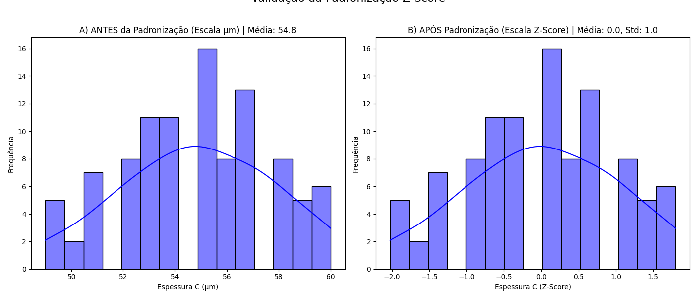
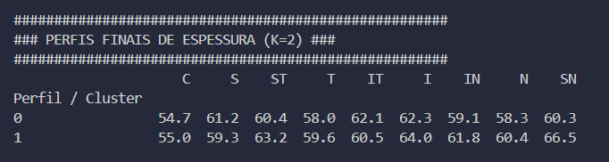
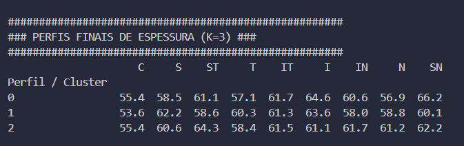
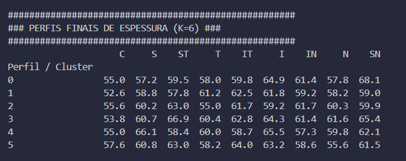
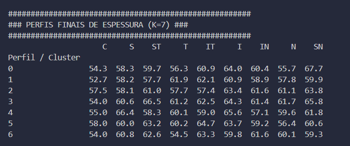
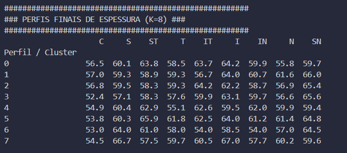

# Análise de Padrões Epiteliais Não Supervisionados

## Resumo Executivo

Este projeto aplica aprendizado de máquina não supervisionado (K-Means) para identificar padrões de espessura no mapa epitelial. A análise revelou que a divisão dos dados em **6 perfis distintos (k=6)** oferece a segmentação mais robusta e estatisticamente significativa, conforme validado pela métrica de Silhueta Média (0.1272).

O script `main.py` automatiza todo o processo, desde o pré-processamento dos dados até a caracterização final dos perfis para múltiplos valores de K, enquanto a análise de resultados (descrita no documento de suporte) foca na interpretação clínica dos 6 perfis encontrados.

## Metodologia

O processo de análise seguiu 3 etapas principais:

### 1. Pré-processamento de Dados
- **Winsorização:** Tratamento de outliers para reduzir o impacto de valores extremos.
- **Padronização (Z-Score):** Normalização dos dados para garantir que todas as variáveis contribuam igualmente para a análise de distância.



### 2. Determinação do Número de Clusters (K)
A escolha de K=6 foi baseada em uma análise combinada do **Método do Cotovelo** (inércia) e do **Coeficiente de Silhueta**, que mede a qualidade da clusterização. O valor K=6 apresentou o maior coeficiente de silhueta, indicando a melhor separação entre clusters.


### 3. Caracterização dos Perfis
O script `main.py` foi executado para gerar os centróides (características médias) de cada um dos 6 perfis, revertendo-os para a escala original (μm) para facilitar a interpretação.

## Os 6 Perfis Epiteliais Identificados (K=6)

A análise resultou na identificação de 6 perfis com características clínicas distintas, conforme proposto no relatório de análise:

| Perfil | Nome Proposto | Característica Clínica Principal |
| :--- | :--- | :--- |
| **0** | Padrão de Coroa Vertical Superior/Nasal | Espessamento máximo em SN e I. Forte inclinação Superior/Nasal. |
| **1** | Padrão Base Fino e Uniforme | Epitélio mais fino na região Central (C) e periferia plana. |
| **2** | Padrão de Afinamento Temporal | Regiões Temporal (T) e Inferior (I) mais finas. |
| **3** | Padrão Periférico Espesso Extremo | O mais espesso de todos, com pico na região Superior Temporal (ST). |
| **4** | Padrão de Acento Superior/Inferior | Forte espessamento polar no eixo vertical (regiões S e I). |
| **5** | Padrão Central Grosso com Acento IT | Epitélio mais grosso na região Central (C) e forte espessamento em IT. |

## Conclusão e Próximos Passos

A análise de cluster foi bem-sucedida em revelar 6 padrões distintos de distribuição de espessura epitelial. A identificação desses perfis permite associá-los a possíveis condições clínicas (olho seco, ceratocone inicial, etc.).

**Próximos Passos Sugeridos:**
1.  **Validação Clínica:** Relacionar os perfis identificados com dados clínicos dos pacientes (idade, diagnóstico, etc.) para atribuir nomes patológicos (ex: "Perfil 4 - Alto Risco de Olho Seco").
2.  **Visualização Avançada:** Gerar gráficos de mapa de calor ou polares para cada perfil, facilitando a interpretação por parte de oftalmologistas e outros profissionais.

## Anexo: Visualização dos Clusters

Abaixo, uma galeria com a visualização dos resultados para diferentes valores de `k`.

| k=2 | k=3 | k=6 |
| :---: | :---: | :---: |
|  |  |  |

| k=7 | k=8 |
| :---: | :---: |
|  |  |

## Como Executar o Projeto

1.  Instale as dependências:
    ```bash
    pip install pandas numpy scikit-learn matplotlib seaborn
    ```
2.  Execute o script principal:
    ```bash
    python main.py
    ```
