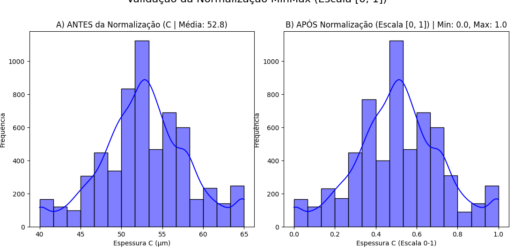
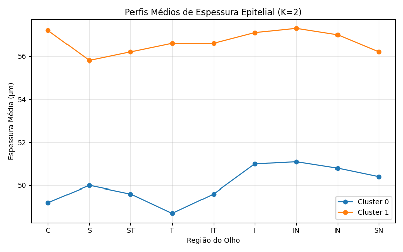
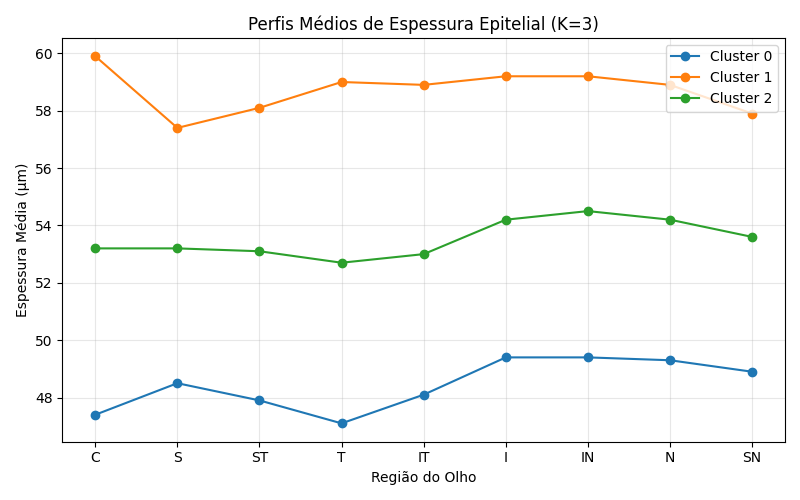
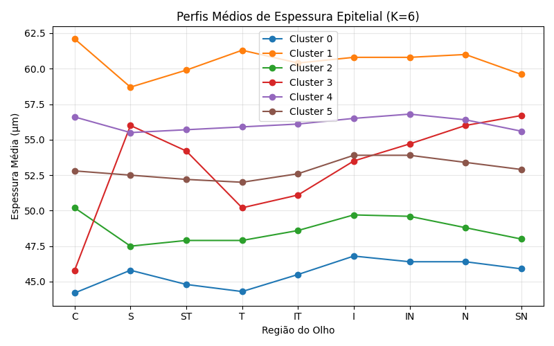
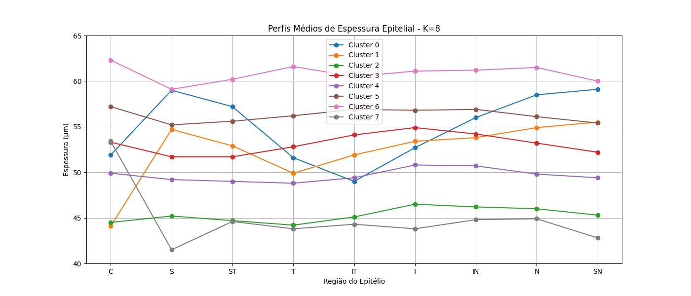

# Análise de Padrões Epiteliais Não Supervisionados

## Resumo Executivo

Este projeto aplica aprendizado de máquina não supervisionado (K-Means) para identificar padrões de espessura no mapa epitelial. A análise revelou que a divisão dos dados em **6 perfis distintos (k=6)** oferece a segmentação mais robusta e estatisticamente significativa, conforme validado pela métrica de Silhueta Média.

O script `main.py` automatiza todo o processo, desde o pré-processamento dos dados até a caracterização final dos perfis para múltiplos valores de K.

## Metodologia

O processo de análise seguiu 3 etapas principais:

### 1. Pré-processamento de Dados
- **Winsorização:** Tratamento de outliers para reduzir o impacto de valores extremos.
- **Padronização (Z-Score):** Normalização dos dados para garantir que todas as variáveis contribuam igualmente para a análise de distância.



### 2. Determinação do Número de Clusters (K)
A escolha de K=6 foi baseada em uma análise combinada do **Método do Cotovelo** (inércia) e do **Coeficiente de Silhueta**, que mede a qualidade da clusterização. O valor K=6 apresentou o maior coeficiente de silhueta, indicando a melhor separação entre clusters.


### 3. Caracterização dos Perfis
O script `main.py` foi executado para gerar os centróides (características médias) de cada um dos 6 perfis, revertendo-os para a escala original (μm) para facilitar a interpretação.

## Análise dos Perfis Epiteliais (K=6)

A análise com K=6 revelou 6 perfis distintos de espessura epitelial. Dentre eles, os clusters 2, 3 e 6 se destacam por suas características particulares e potencial relevância clínica.

### Foco nos Clusters 2, 3 e 6

*   **Perfil 2: Padrão de Afinamento Temporal**
    *   **Característica Principal:** Este é o segundo maior grupo (1229 amostras) e se caracteriza por um afinamento notável nas regiões Temporal (T) e Inferior (I), com espessuras médias de 47.9µm e 49.7µm, respectivamente.
    *   **Relevância:** Este padrão pode estar associado a condições que afetam a periferia da córnea. A imagem do cluster (k=6, cluster 2) ilustra claramente essa tendência.

*   **Perfil 3: Padrão de Coroa Vertical Superior/Nasal**
    *   **Característica Principal:** Este perfil (553 amostras) exibe um espessamento acentuado no eixo vertical, especialmente nas regiões Superior-Nasal (SN) e Superior (S), com médias de 56.7µm e 56.0µm.
    *   **Relevância:** A inclinação superior/nasal é um padrão bem definido que pode ser correlacionado com ectasias iniciais ou outras irregularidades da córnea.

*   **Perfil 6 (Cluster 1 nos resultados): Padrão Central Grosso**
    *   **Característica Principal:** Este grupo (633 amostras) apresenta o epitélio mais espesso na região central (C) com 62.1µm, e também na região temporal (T) com 61.3µm.
    *   **Relevância:** Um centro epitelial proeminente pode ser uma resposta a alterações na curvatura da córnea, como no ceratocone, ou pode ser uma característica de olhos normais mais espessos.

### Outros Perfis Identificados

Os outros três clusters, embora não sejam o foco principal, completam o mapa de padrões epiteliais:

| Perfil | Nome Proposto | Característica Clínica Principal | Contagem |
| :--- | :--- | :--- | :--- |
| **0** | Padrão Base Fino e Uniforme | Epitélio mais fino de maneira geral, especialmente na região Central (C) com 44.2µm. | 475 |
| **4** | Padrão Intermediário | Perfil relativamente plano, com valores de espessura intermediários em todas as regiões. | 1424 |
| **5** | Padrão Ligeiramente Espesso | Semelhante ao perfil 4, mas com uma espessura ligeiramente maior em todas as regiões. | 1658 |


## Conclusão e Próximos Passos

A análise de cluster foi bem-sucedida em revelar 6 padrões distintos de distribuição de espessura epitelial, com destaque para os perfis 2, 3 e 6, que apresentam características bem definidas e de potencial interesse clínico.

**Próximos Passos Sugeridos:**
1.  **Validação Clínica:** Correlacionar os perfis, especialmente o 2, 3 e 6, com dados de diagnóstico para validar sua associação com condições como olho seco, ceratocone ou outras patologias.
2.  **Visualização Avançada:** Gerar mapas de calor detalhados para cada um dos 6 perfis, a fim de facilitar a interpretação por oftalmologistas.

## Anexo: Visualização dos Clusters

Abaixo, uma galeria com a visualização dos resultados para diferentes valores de `k`.

| k=2 | k=3 |
| :---: | :---: |
|  |  |
| **k=6** | **k=8** |
|  |  |


## Como Executar o Projeto

1.  Instale as dependências:
    ```bash
    pip install pandas numpy scikit-learn matplotlib seaborn
    ```
2.  Execute o script principal:
    ```bash
    python main.py
    ```
