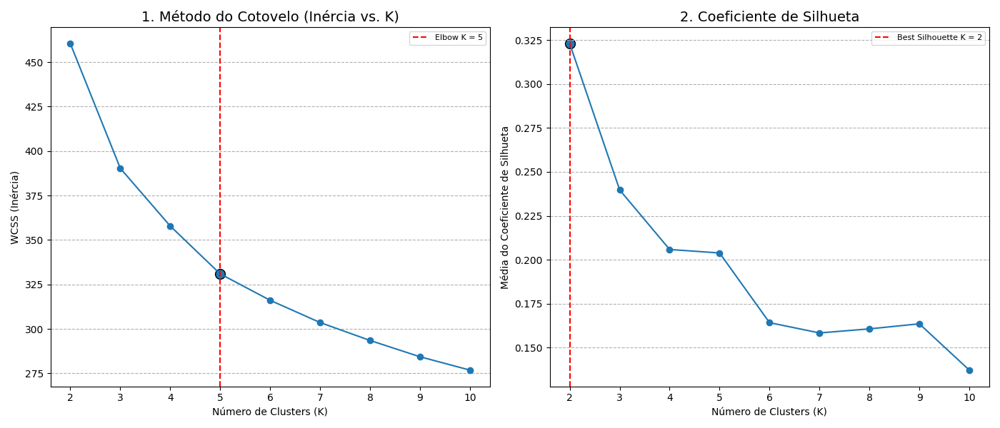

# Análise de Padrões Epiteliais Não Supervisionados

Este projeto utiliza técnicas de aprendizado de máquina não supervisionado, especificamente o algoritmo de clusterização K-Means, para identificar e analisar padrões em dados simulados de espessura de epitélio.

O objetivo é agrupar medições semelhantes, revelando "perfis" ou "padrões" que poderiam não ser aparentes em uma análise manual.

## Metodologia

O fluxo de trabalho é dividido em três fases principais: pré-processamento, mineração (clusterização) e avaliação.

### 1. Pré-processamento e Transformação de Dados

Antes de aplicar o algoritmo de clusterização, os dados brutos passam por um tratamento rigoroso para garantir a qualidade e a comparabilidade.

#### a. Tratamento de Outliers (Winsorização)

Valores extremos (outliers) podem distorcer a análise de cluster. A Winsorização foi aplicada para limitar esses valores, substituindo-os por valores nos quantis 5% (inferior) e 95% (superior). O gráfico abaixo mostra a distribuição de cada variável antes e depois do tratamento.


#### b. Padronização (StandardScaler)

Como as variáveis podem ter escalas diferentes, a padronização (Z-score) é essencial. Ela transforma os dados para que tenham uma média de 0 e um desvio padrão de 1, garantindo que todas as variáveis contribuam igualmente para a análise.


### 2. Mineração: Encontrando o Número Ideal de Clusters (k)

O K-Means requer que o número de clusters (k) seja definido previamente. Para encontrar o valor ideal de `k`, foram utilizados dois métodos complementares:

*   **Método do Cotovelo (Elbow Method):** Analisa a inércia (soma das distâncias quadráticas dentro de cada cluster). O "cotovelo" no gráfico indica um ponto onde aumentar `k` não traz um ganho significativo.
*   **Análise de Silhueta (Silhouette Analysis):** Mede quão bem cada ponto se encaixa em seu próprio cluster em comparação com outros. Valores mais altos indicam clusters mais bem definidos.

O gráfico abaixo apresenta os resultados de ambos os métodos, ajudando na escolha de `k`.



### 3. Resultados da Clusterização

Com base na análise, foram gerados os agrupamentos para diferentes valores de `k`. As imagens abaixo (provavelmente gráficos de radar ou perfis de centróides) ilustram os padrões encontrados para cada configuração.

| k=2 | k=3 |
| :---: | :---: |
|  |  |

| k=6 | k=7 |
| :---: | :---: |
|  |  |

| k=8 |
| :---: |
|  |

## Como Executar o Projeto

1.  Certifique-se de ter as dependências instaladas.
2.  Execute o script principal na linha de comando:

```bash
python main.py
```

## Dependências

O projeto foi desenvolvido em Python e utiliza as seguintes bibliotecas:

*   `pandas`
*   `numpy`
*   `scikit-learn`
*   `matplotlib`
*   `seaborn`

Você pode instalá-las usando o pip:

```bash
pip install pandas numpy scikit-learn matplotlib seaborn
```